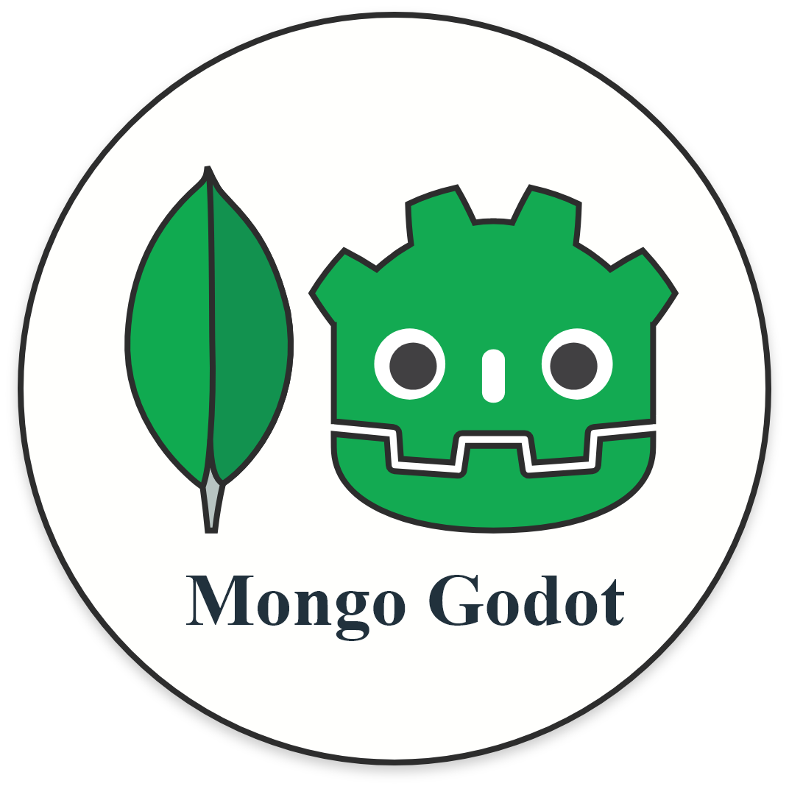

Mongo Driver for Godot
=========================================
###### (Get it from Godot Asset Library - Coming Soon)



### Unofficial MongoDB driver for Godot Engine 3.3.

> Should support Windows, Linux, OSX (Currently only tested on Windows)


<br>


Features
--------------

- CRUD operations on Database/Collection
- Document validation
- Pipeline / Aggregation operations
- Run commands on Database
- Operations on Collection Indexes


Installation
--------------

This is a regular plugin for Godot.
Copy the contents of `addons/mongo-driver-godot` into the `addons/` folder in the same directory as your project, and activate it in your project settings.


> For in-depth installation instructions check the [Installation Wiki](https://3ddelano.github.io/mongo-driver-godot/installation)


Getting Started
----------

1. After activating the plugin. You may have to restart the Godot Editor.
2. Connect the various signals (`bot_ready`, `guild_create`, `message_create`, `message_delete`, etc) of the `DiscordBot` node to the parent node, either through the editor or in the script using the `connect()` method.


```GDScript
extends Node

func _ready():
	var driver = MongoDriver.new()
    var connection = driver.connect_to_server("mongodb://localhost:27017")

    if Mongo.is_error(connection):
        print("Got error: ", connection)
        return

    connection = connection as MongoConnection
    print(connection.get_database_names())
```

[Documentation](https://3ddelano.github.io/mongo-driver-godot)
----------


Contributing
-----------

This plugin is a non-profit project developped by voluntary contributors.

### Supporters

```
None, you can be the first one!
```

### Support the project development
<a href="https://www.buymeacoffee.com/3ddelano" target="_blank"></a>

Want to support in other ways? Contact me on Discord: `@3ddelano#6033`

For doubts / help / bugs / problems / suggestions do join: [3ddelano Cafe](https://discord.gg/FZY9TqW)

#### Disclaimer: This project is not affiliated nor endorsed by MongoDB Inc. nor Godot Engine