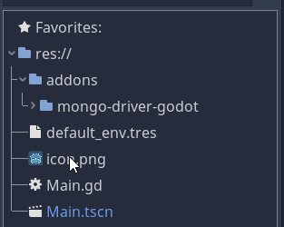

## From Asset Library

Coming soon.

## From Github
1. ### Download the code
   Download the repo from the master or [Releases](https://github.com/3ddelano/mongo-driver-godot/releases) section<br>
   { loading=lazy }

2. ### Add to project
   Copy the `mongo-driver-godot` folder from the `addons` folder from the downloaded zip to the `addons` folder in the directory of your Godot project. If your project does not already have a `addons` folder, make a new one. Your project folder should look something like this:<br>
   { loading=lazy }

3. There is **NO need** to enable the plugin in ProjectSettings. You might need to close and open the project for the GDNative classes to register.

4. ### Minmal Example
   Use the following snippet to connect to a database:
   ```
   extends Control

   func _ready() -> void:
      var driver: MongoDriver = MongoDriver.new()
      var connection: MongoConnection = driver.connect_to_server("mongodb://localhost:27017")
      print(connection.get_database_names())
   ```